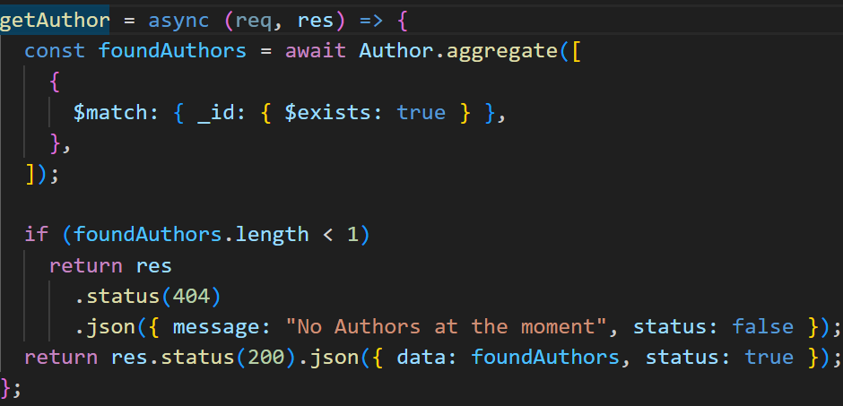

# Mongoose Aggregation: the query master.

## Introduction

**Mongoose aggregation**: is a powerful feature provided by the Mongoose library for MongoDB in Node.js. It allows you to perform complex data manipulations and transformations on MongoDB collections using a pipeline of stages.

You should know **Mongoose aggregation** if you are working with MongoDB and need to perform advanced data analysis, reporting, or data processing tasks. Aggregation provides a way to combine, filter, transform, and analyze data in a flexible and efficient manner.

Are you working with **MongoDB** and **Node.js**? Are you a data analyst, and database administrator who must work with large datasets and perform complex data operations in the backend using nodejs? Then this article is for you.

## Things To Be Covered

For this article, I will be guiding you on how to use the following aggregation pipelines using an Author Management Application:

- match
- lookup
- project
- group

## Prerequisites

Prerequisites for learning Mongoose aggregation includes:

- A basic understanding of MongoDB,
- Basic knowledge of Node.js,
- install MongoDB compass
- and the Mongoose library.
- Familiarity with JavaScript and JSON is also helpful.

I will be using Microsoft visual studio code(vs code) for this article, feel free to use any of your choices.

## Set Up Environment

To start up, let's navigate to the terminal and install the following in the code snippet below:

    cd desktop
    mkdir mongoose_aggregration
    cd mongoose_aggregration
    npm init -y
    npm install mongoose express cors dotenv
    code .

In the code snippet above, I navigated to the desktop directory and created a directory named **mongoose_aggregration** , I went into the folder and initialize package.json with its default configuration. I then installed the necessary packages that will be needed and finally opened the directory in vs code.

Let's go into the package.json file and adjust the script property as shown below:

## Starting Up The Server And Connect to the Database

To set up a node server and connect to your MongoDB kindly use the following link. Let's check if everything is fine by running dev in the terminal as shown below:

> npm run dev

If you see the code snippet below, you have successfully started a server and connected to the **MongoDB database**.

> server ready on 4000
> connected successfully

## Folder Structure

Let's go into the root directory and run the following as shown below:

    mkdir controller routes model

    cd model

    touch coreModel.js author.js follower.js books.js

    cd ..

    cd controller

    touch authorServices.js bookServices.js

    cd..

    cd routes

    touch authorServices.js

    touch bookServices.js

In the code snippet above, I created three folders in the root directory and create files into the folders accordingly.

## Schema Design

Inside the coreModel.js let's create a model that will handle common schema properties as shown below:

The coreModel schema handles the name and photo property which will be shared amongst other schemas that I will be creating shortly. I set a discriminatorKey that will be used to identify the schemas individually.

Do you want to know more about _**discriminatorKey / schema inheritance**_, I have written an article on it, which can be found [here](https://medium.com/r/?url=https%3A%2F%2Fblog.devgenius.io%2Fmongoose-discriminator-an-easy-way-to-inherit-schema-properties-6c6e89c3795)

### Author Schema

Inside the author.js , let's add the following code snippet:

The _coreModel_ is imported and I passed the unique identifier and the schema using the [discriminator](https://medium.com/r/?url=https%3A%2F%2Fblog.devgenius.io%2Fmongoose-discriminator-an-easy-way-to-inherit-schema-properties-6c6e89c3795) property of the coreModel . Haven did this, it would enable me to only define the other author's properties that are unique to them and inherit the name and photo property from the coreModel.

### Books Schema

An author should be able to have a book and followers, let's also create a model that will handle them as shown below:

Just like the author's schema, only the unique book properties are created and the _name_ and _photo_ properties will be inherited from the coreModel.

### Followers Schema

Unlike the author and **books schema**, nothing was inherited from the **coreModel schema**. It handles the followers of the authors and have them drop a comment along.

### Creating of Controllers

Inside the **authorServices.js** file, let's add the following to it:

I used a class base controller and created the **createAuthor** method that will handle the creation of an author. A check was made to verify if the author already exists, and I used the **trycatch method** to watch out for any server error while trying to save the author to the database.

### Creating Routes

Let's try and create a route that will handle the **authorServices controller** as shown below:

The **AuthorServices class** was imported and a new instance was created from it so we could have access to it's methods and the **createAuthor** method was passed into the post method of the router.

Finally, the router was imported to the **server.js** to be used as shown below:

## Making Request withIn VsCode

Moving forward, I will be using an vs code extension called:

    httpYac - Rest Clientv5.5.6By Andreas Weber

To get started with the **vs code extension**, all it needs is to create a file with an **http-extension(filename.http)**, and follow the [guideline](https://medium.com/r/?url=https%3A%2F%2Fmarketplace.visualstudio.com%2Fitems%3FitemName%3Danweber.vscode-httpyac) to get started
Inside the file - reques.http, let's create a new author as shown below:

**HttpYac** allows us to declare a global variable and use them as shown in the snippet above. I made a post request, set the headers and passed the global variables in the body of the request.

### Get the Authors (Match stage)

**Match Pipeline** filters the documents based on a specified condition. Let's add the code snippet as shown below inside of the **AuthorServices class** I declared above:

To use **Mongoose aggregate**, I have to use the aggregate method that comes with the model , it accepts an array and has all the **pipelines/stages** as an object in it.

The **Match stage** was used to get all the authors that have the **\_id** property. **_Mongoose Aggregate_** returns an array so I checked to know if an author was found, and get the authors data from the MongoDB database.

Inside the **authorServices route**, let's chain the get method to the route as shown below:

Let's take a look at how the data that was created looks in the code snippet below:

### Create Books

Let's go into the **_bookServices.js_** file and add the following code snippets:

Just like the **_authorServices.js_** , a book class was created and saved the book data to the database.

> Note: the follower's controller/routes will be in line with > the other controllers I created above.

### Using Lookup Stage

**lookup stage** is used to perform a left outer join with another collection. Let's add the code snippet as shown below inside of the **_BookServices class_** I declared above:

In the snippet above, I used the match to get an author whose **_\_id_** properties match the Id of an author that was sent as a query and got all the books of the specified author using the **lookup stage**

The **lookup stage** can take up to six fields but let's look into the once that was used as listed below:

    from: takes up a collection name to access. In this case, the coremodels collection
    localField: takes up the fields to match the collection that the aggregate method was called upon. In this case, it was the author model
    foreignField: takes up the field that is inside of the collection I added in the from above - coremodels collection
    as : represent a name that holds the return value of the lookup stage - authorsBook

Inside the **_authorServices route_**, let's chain the get method to the route as shown below:

The above books request will return the following result:

In the code snippet above, It returns the author's data, and inside of the authorsBook is where the lookup result was set. Remember, what I wanted to do is to get just the books of the author and not the author's properties too.

### Using Project Stage

**Project stage** specifies the fields to include or exclude in the output documents. So let's add the following code snippet into the **_getBooksByAuthor method_** of the Books class using **project stage**

**Aggregate query** uses the dollar sign($) to access its variables/document properties, so all I had to do was to create a field and assign it the output field name to return to the client. Let's take a look at the returned result below:

### Using Group Stage

Groups stages arranges the documents by a specified field and performs aggregation operations on each group. Let's create a new method inside BookServices class that gets all the books of the individual authors, names of the authors and followers as shown below:

I combined the **lookup stage** which gets all authors, the group stage were used to separate the individual authors using their \_id and defined a variable for the group fields.
When using group staging, it only allows the \_id field to be passed directly while others need an **_accumulator($first)_** to add other fields as shown in the code snippet above.

Let's take a look at the code snippet below to see what data was returned.

The snippet above gets us the authors \_id , names, books of the individual authors and their followers if any.

## Summary of Mongoose aggregation:

**Mongoose aggregation** is a powerful feature that allows you to perform complex data manipulations and transformations on MongoDB collections. It is helpful for advanced data analysis, reporting, and data processing tasks.

I believe that going forward, you will start using **Mongoose aggregate** for querying data from the mongoDB database.
If this article was helpful to you, kindly clap, like, comment, share and follow me on my [Linkedin](https://medium.com/r/?url=https%3A%2F%2Fwww.linkedin.com%2Fin%2Fchime-princewill-3a2b1b192%2F) and [Medium](https://medium.com/r/?url=https%3A%2F%2Fprincewillchime43.medium.com%2F) to see more of my articles. Click the following link to access the [source code](https://medium.com/r/?url=https%3A%2F%2Fgithub.com%2Fchibuike07%2Fmongoose_aggregation) and kindly give me a **_star_**.

Feel free to drop any suggestions/comments. If you have a topic based on the Javascript/React.js ecosystem, kindly reach out and I'd be glad to write on it. Thanks
